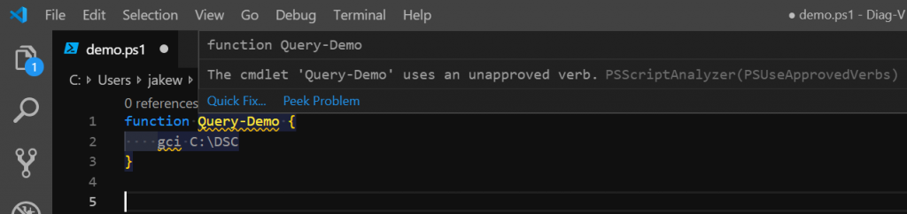

How to use PowerShell with Visual Studio Code like a Pro


Example Scripts
---------------

Now you are ready to play and work with PowerShell and Visual Studio Code.  
If you want to try them with some example scripts, you can click on the menu **File->Open Folder** or hit **Ctrl+K Ctrl+O** quickly and navigate to this folder:  

```powershell
C:\Users\<USERNAME>\.vscode\extensions\ms-vscode.PowerShell-<VERSION>\examples
```

You can open Code directly from a PowerShell terminal typing this command:  

```powershell
code (Get-ChildItem $Home\.vscode\extensions\ms-vscode.PowerShell-*\examples)[-1]
```

####  Install the PowerShell Extension

VSCode does not natively support PowerShell. To effectively write, debug, see syntax highlighting, use code snippets, and have intellisense for cmdlets, you’ll need to install the [PowerShell extension](https://marketplace.visualstudio.com/items?itemName=ms-vscode.PowerShell).


#### 3 – PowerShell Script Analyzer

The PowerShell Script Analyzer is a PowerShell module that acts as a static code checker. It will check your PowerShell code by running a set of rules to ensure you are adhering to best practices, and correct syntax. When you have both VSCode and the PowerShell Script Analyzer installed, VSCode will continuously check your code as you write it. Any errors will be displayed by visual queues in the editor.



A specific configuration for PowerShell files
---------------------------------------------

In the command palette (**Ctrl+Shift+P** or **Cmd+Shift+P** on Mac) write **Open Settings (JSON)**.  
Now you can see your preferences without the pretty UI.  
Here you can add some additional settings specific for PowerShell.  

```powershell
  "powershell.integratedConsole.focusConsoleOnExecute": false,
  "powershell.integratedConsole.showOnStartup": false,
  "[powershell]": {
    "editor.renderWhitespace": "all",
    "editor.renderControlCharacters": true,
    "files.trimTrailingWhitespace": true,
    "files.encoding": "utf8bom",
    "files.autoGuessEncoding": true,
    "editor.tabCompletion": "on"
  }
```

```json
{

// editor

"editor.quickSuggestionsDelay": 1,

"editor.tabCompletion": "on",

"files.defaultLanguage": "powershell",

// default shell

// Windows

// PowerShell 6

"terminal.integrated.shell.windows": "C:\\\\Program Files\\\\PowerShell\\\\6\\\\pwsh.exe",

"powershell.powerShellExePath": "C:\\\\Program Files\\\\PowerShell\\\\6\\\\pwsh.exe",

//PowerShell 5.1 and below

// "terminal.integrated.shell.windows": "C:\\\\WINDOWS\\\\System32\\\\WindowsPowerShell\\\\v1.0\\\\powershell.exe",

// "powershell.powerShellExePath": "C:\\\\WINDOWS\\\\System32\\\\WindowsPowerShell\\\\v1.0\\\\powershell.exe",

// Linux

// Ubuntu

// "terminal.integrated.shell.linux": "/snap/powershell/36/opt/powershell/pwsh",

// "powershell.powerShellExePath": "/snap/powershell/36/opt/powershell/pwsh",

// powershell settings changes

"powershell.codeFormatting.preset":"Stroustrup",

"powershell.startAutomatically": true,

"powershell.scriptAnalysis.enable": true,

"powershell.integratedConsole.showOnStartup": false,

"powershell.integratedConsole.focusConsoleOnExecute": true,

}
```


## How to debug PowerShell Script

Now Visual Studio Code creates a file in your directory called _launch.json_ with your debugging settings.  
You can replace the content with this JSON:  

```
{
  "version": "0.2.0",
  "configurations": [
      {
          "type": "PowerShell",
          "request": "launch",
          "name": "PowerShell Launch (current file)",
          "script": "${file}",
          "args": [],
          "cwd": "${file}"
      },
      {
          "type": "PowerShell",
          "request": "attach",
          "name": "PowerShell Attach to Host Process",
          "processId": "${command.PickPSHostProcess}",
          "runspaceId": 1
      },
      {
          "type": "PowerShell",
          "request": "launch",
          "name": "PowerShell Interactive Session",
          "cwd": "${workspaceRoot}"
      }
  ]
}
```

```json
{  
    "version": "0.2.0",  
    "configurations": \[  
        {  
            "type": "PowerShell",  
            "request": "launch",  
            "name": "PowerShell Launch Debug.ps1",  
            "script": "${workspaceRoot}\\\\Debug.ps1",  
            "args": \[\],  
            "cwd": "${workspaceRoot}"  
        },  
        {  
            "type": "PowerShell",  
            "request": "launch",  
            "name": "PowerShell Launch Current File",  
            "script": "${file}",  
            "args": \[\],  
            "cwd": "${file}"  
        },  
        {  
            "type": "PowerShell",  
            "request": "launch",  
            "name": "PowerShell Launch Current File in Temporary Console",  
            "script": "${file}",  
            "args": \[\],  
            "cwd": "${file}",  
            "createTemporaryIntegratedConsole": true  
        },  
        {  
            "type": "PowerShell",  
            "request": "launch",  
            "name": "PowerShell Launch Current File w/Args Prompt",  
            "script": "${file}",  
            "args": \[  
                "${command:SpecifyScriptArgs}"  
            \],  
            "cwd": "${file}"  
        },  
        {  
            "type": "PowerShell",  
            "request": "attach",  
            "name": "PowerShell Attach to Host Process",  
            "processId": "${command:PickPSHostProcess}",  
            "runspaceId": 1  
        },  
        {  
            "type": "PowerShell",  
            "request": "launch",  
            "name": "PowerShell Interactive Session",  
            "cwd": "${workspaceRoot}"  
        }  
    \]  
}
```


## Code Snippets for PowerShell

From the command palette (**Ctrl+Shift+P** or **Cmd+Shift+P** on Mac) type **snippet** and select **Configure User Snippet** and then **PowerShell**.
Now you can paste the following JSON file with some snippets.
You can add your snippets, as well.

```json
{
    "Condition statement": {
        "prefix": "cond",
        "body": [
            "${_} { ${0}; break }"
        ],
        "description": "Switch condition statement"
    },


    "Condition single quoted string statement": {
        "prefix": "condsqstr",
        "body": [
            "'${_}' { ${0}; break }"
        ],
        "description": "Switch condition single quoted string statement"
    },


    "Condition double quoted string statement": {
        "prefix": "conddqstr",
        "body": [
            "\"${_}\" { ${0}; break }"
        ],
        "description": "Switch condition double quoted string statement"
    },
    
    "Condition expression statement": {
        "prefix": "condexpr",
        "body": [
            "{${_}} { ${0}; break }"
        ],
        "description": "Switch condition expression statement"
    },


    "Do...while loop": {
        "prefix": "do",
        "body": [
            "do {",
            "\t$0",
            "} while (${$variable});"
        ],
        "description": "Do...while loop"
    },


    "Do...until loop": {
        "prefix": "do",
        "body": [
            "do {",
            "\t$0",
            "} until (${$variable});"
        ],
        "description": "Do...until loop"
    },


    "Else statement": {
        "prefix": "else",
        "body": [
            "else {",
            "\t$0",
            "}"
        ],
        "description": "Else statement"
    },


    "ElseIf statement": {
        "prefix": "elseif",
        "body": [
            "elseif (${$variable}) {",
            "\t$0",
            "}"
        ],
        "description": "Elseif statement"
    },


    "Foreach statement": {
        "prefix": "foreach",
        "body": [
            "foreach (${$item} in ${$collection}) {",
            "\t$0",
            "}"
        ],
        "description": "Foreach statement"
    },


    "For loop": {
        "prefix": "for",
        "body": [
            "for (${$i} = 0; ${$i} -lt ${$length}; ${$i}++) {",
            "\t$0",
            "}"
        ],
        "description": "For loop"
    },


    "If statement": {
        "prefix": "if",
        "body": [
            "if (${$variable}) {",
            "\t$0",
            "}"
        ],
        "description": "If statement"
    },


    "Reverse for loop": {
        "prefix": "forr",
        "body": [
            "for (${$i} = ${$length} - 1; ${$i} -ge 0; ${$i}--) {",
            "\t$0",
            "}"
        ],
        "description": "Reverse for loop"
    },


    "Switch statement": {
        "prefix": "switch",
        "body": [
            "switch (${$variable}) {",
            "\t${condition} { ${action}; break }",
            "\tDefault {}",
            "}"
        ],
        "description": "Switch statement"
    },


    "Try catch": {
        "prefix": "try",
        "body": [
            "try {",
            "\t${_}",
            "}",
            "catch [${System.Exception}] {",
            "\t# Exception is stored in the automatic variable $_",
            "\t$0",
            "}"
        ],
        "description": "Try catch"
    },


    "Try catch finally": {
        "prefix": "trycf",
        "body": [
            "try {",
            "\t${_}",
            "}",
            "catch [${System.Exception}] {",
            "\t# Exception is stored in the automatic variable $_",
            "\t$0",
            "}",
            "finally {",
            "\t$1",
            "}"        ],
        "description": "Try catch finally"
    },


    "Try finallly": {
        "prefix": "tryf",
        "body": [
            "try {",
            "\t${_}",
            "}",
            "finally {",
            "\t$0",
            "}"
        ],
        "description": "Try finally"
    },


    "While loop": {
        "prefix": "while",
        "body": [
            "while (${$variable}) {",
            "\t$0",
            "}"
        ],
        "description": "While loop"
    },


    "Class": {
        "prefix": "class",
        "body": [
            "class ${Name} {",
            "\t$0",
            "}"
        ],
        "description": "Class"
    },


    "Enum": {
        "prefix": "enum",
        "body": [
            "enum ${Name} {",
            "\t$0",
            "}"
        ],
        "description": "Enum"
    },


    "Method": {
        "prefix": "meth",
        "body": [
            "[$1] $2() {",
            "\t$0",
            "}"
        ],
        "description": "Method"
    },


    "Property": {
        "prefix": "prop",
        "body": [
            "[${string}] ${$Property}$0"
        ],
        "description": "Class property"
    },


    "Property hidden": {
        "prefix": "proph",
        "body": [
            "hidden [${string}] ${$Property}$0"
        ],
        "description": "Hidden class property"
    },


    "Function": {
        "prefix": "func",
        "body": [
            "function $1() {",
            "\t$0",
            "}"
        ],
        "description": "Function"
    },


    "Function advanced": {
        "prefix": "funcadv",
        "body": [
            "<#",
            ".SYNOPSIS",
            "\tShort description",
            ".DESCRIPTION",
            "\tLong description",
            ".EXAMPLE",
            "\tExample of how to use this cmdlet",
            ".EXAMPLE",
            "\tAnother example of how to use this cmdlet",
            "#>",
            "function ${verb}-${noun} {",
            "\t[CmdletBinding()]",
            "\t[OutputType([${int}])]",
            "\tparam(",
            "\t\t[Parameter(Mandatory=$true)]",
            "\t\t[${string}]",
            "\t\t${Param1}",
            "\t)",
            "\t",
            "\tbegin {",
            "\t}",
            "\t",
            "\tprocess {",
            "\t\t$0",
            "\t}",
            "\t",
            "\tend {",
            "\t}",
            "}"
        ],
        "description": "Advanced function"
    },


    "Help": {
        "prefix": "help",
        "body": [
            "<#",
            ".SYNOPSIS",
            "\tShort description",
            ".DESCRIPTION",
            "\tLong description",
            ".PARAMETER Path",
            "\tSpecifies a path to one or more locations.",
            ".PARAMETER LiteralPath",
            "\tSpecifies a path to one or more locations. Unlike Path, the value of LiteralPath is used exactly as it",
            "\tis typed. No characters are interpreted as wildcards. If the path includes escape characters, enclose",
            "\tit in single quotation marks. Single quotation marks tell Windows PowerShell not to interpret any",
            "\tcharacters as escape sequences.",
            ".PARAMETER InputObject",
            "\tSpecifies the object to be processed.  You can also pipe the objects to this command.",
            ".EXAMPLE",
            "\tC:\\PS>",
            "\tExample of how to use this cmdlet",
            ".EXAMPLE",
            "\tC:\\PS>",
            "\tAnother example of how to use this cmdlet",
            ".INPUTS",
            "\tInputs to this cmdlet (if any)",
            ".OUTPUTS",
            "\tOutput from this cmdlet (if any)",
            ".NOTES",
            "\tGeneral notes",
            ".COMPONENT",
            "\tThe component this cmdlet belongs to",
            ".ROLE",
            "\tThe role this cmdlet belongs to",
            ".FUNCTIONALITY",
            "\tThe functionality that best describes this cmdlet",
            "#>"
        ],
        "description": "Help comment block"
    }
}
```